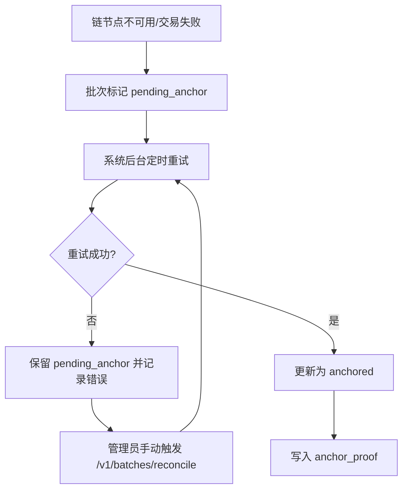
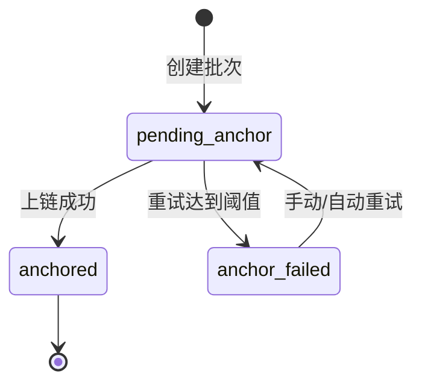

# PRD：区块链荔枝溯源与智能采摘系统

- 文档版本：`v1.0`
- 文档日期：`2026-03-02`
- 项目仓库：`lychee-ripe`
- 文档目标：用于产品需求对齐与研发执行，定义当前版本软件系统的完整需求与验收标准。

## 1. 背景与产品目标

本项目当前已具备荔枝目标检测与成熟度识别能力（`green/half/red/young` 四类），并形成 `frontend -> gateway -> app` 的在线识别链路。  
当前版本在此基础上新增“区块链溯源”闭环，形成可核验、可追溯的软件系统能力。

### 1.1 目标

1. 完成 MVP 闭环：`实时识别 -> 建批 -> 链上锚定 -> 公开验真`。
2. 强化业务可信与可追溯能力：展示数据防篡改、可核验、可追踪。
3. 保持既有识别能力稳定，不引入硬件依赖。

### 1.2 非目标

1. 不实现机械臂、传感器、IoT 网关等硬件接入。
2. 不覆盖生产级多租户与复杂角色体系。
3. 不扩展为完整供应链 ERP。

## 2. 用户与使用场景

### 2.1 目标用户

1. 果园管理员（第一主用户）
2. 采购方/监管方/消费者（查询与验真用户）
3. 开发团队（实现与联调用户）

### 2.2 核心场景

1. 管理员在识别页面启动实时识别，确认成熟度汇总后创建采摘批次。
2. 系统将批次摘要写入本地库并发起链上锚定，返回 `trace_code`。
3. 用户扫码访问公开溯源页，查看批次摘要与验签结果（`pass/fail/pending`）。
4. 链服务异常时，批次保持 `pending_anchor`，链恢复后补链并更新状态。

## 3. 范围定义

### 3.1 In Scope（当前版本必须完成）

1. 三页前端信息架构：
   - 识别建批页
   - 溯源查询页
   - 数据看板页
2. 网关新增业务接口（建批、查询、看板、补链）。
3. SQLite 业务持久化。
4. EVM 本地私有测试链锚定与哈希校验。
5. 写接口鉴权、查询接口公开。

### 3.2 Out of Scope（明确排除）

1. 任何硬件与 IoT 设备开发。
2. 公网主网部署与真实资产交易。
3. 多组织治理、复杂 RBAC、多租户隔离。
4. 算法 KPI 数值目标承诺（仅保留功能闭环与稳定性要求）。

## 4. 业务流程

### 4.1 主流程（识别建批到公开验真）

```mermaid
flowchart LR
    A[管理员打开识别建批页] --> B[实时摄像头识别]
    B --> C[前端展示成熟度汇总]
    C --> D[管理员确认创建批次]
    D --> E[gateway 写入 SQLite]
    E --> F[gateway 计算 anchor_hash 并调用合约]
    F --> G{上链成功?}
    G -- 是 --> H[状态=anchored 保存 tx_hash]
    G -- 否 --> I[状态=pending_anchor]
    H --> J[返回 trace_code]
    I --> J
    J --> K[公众扫码访问 /v1/trace/{trace_code}]
    K --> L[gateway 返回摘要+验签结论]
```

### 4.2 异常补链流程（链故障恢复）



## 5. 系统架构与模块职责

### 5.1 架构边界

`frontend -> gateway -> app`

- `frontend`：识别展示、建批操作、扫码查询与看板可视化。
- `gateway`：鉴权限流、业务编排、SQLite 持久化、EVM 链交互、验签判断。
- `app`：YOLO 推理与成熟度结果输出（保持既有接口兼容）。

### 5.2 职责约束

1. 前端不直连 `app`，仅通过 `gateway`。
2. `gateway` 负责链业务编排（Go 原生链 SDK）。
3. `app` 不承担区块链逻辑，专注识别稳定性。

## 6. 功能需求明细（按 3 页）

## 6.1 页面一：识别建批页

### 6.1.1 功能点

1. 调用既有实时流识别，展示当前帧与会话成熟度汇总。
2. 前端路由落位为 `/batch/create`，用于管理员识别与建批操作。
3. 支持填写/选择果园与地块信息（预置下拉 + 手动补充）。
4. 允许管理员确认并提交建批。
5. 提交后返回批次信息：`batch_id`、`trace_code`、`status`、`tx_hash(可空)`。

### 6.1.2 交互要求

1. 提交成功后可一键复制溯源链接。
2. `pending_anchor` 明确提示“已保存，待补链”。
3. 写接口失败时展示可读错误文案。

## 6.2 页面二：溯源查询页（公开）

### 6.2.1 功能点

1. 支持二维码落地 URL 查询（`/trace/{trace_code}`），并提供手动输入入口（`/trace`）。
2. 展示批次摘要：果园、地块、采摘时间、成熟度分布、建议。
3. 展示验签结果：
   - `pass`：链上与库内摘要一致
   - `fail`：摘要不一致或校验失败
   - `pending`：尚未上链

### 6.2.2 交互要求

1. 查询接口无需登录。
2. 验签状态颜色与文案清晰可辨。
3. 内部跳转到溯源码详情时支持“返回来源页”（如从看板返回看板）。

## 6.3 页面三：数据看板页

### 6.3.1 功能点

1. 展示批次数量、状态分布（`anchored/pending_anchor/anchor_failed`）。
2. 展示成熟度分布（`green/half/red/young`）。
3. 展示最近上链记录与失败重试统计。
4. 前端路由落位 `/dashboard`，用于管理员查看聚合指标。

### 6.3.2 交互要求

1. 默认按时间倒序展示最近批次。
2. 支持手动刷新数据。

## 7. 数据模型与状态机

### 7.1 核心类型

#### `BatchCreateRequest`

| 字段 | 类型 | 必填 | 说明 |
| --- | --- | --- | --- |
| orchard_id | string | 是 | 果园标识（单租户内唯一） |
| orchard_name | string | 是 | 果园名称 |
| plot_id | string | 是 | 地块标识 |
| plot_name | string | 否 | 地块名称 |
| harvested_at | string(date-time) | 是 | 采摘时间 |
| summary | object | 是 | 成熟度汇总 |
| summary.total | integer | 是 | 检测总数 |
| summary.green | integer | 是 | 青果数量 |
| summary.half | integer | 是 | 半熟数量 |
| summary.red | integer | 是 | 红果数量 |
| summary.young | integer | 是 | 嫩果数量 |
| note | string | 否 | 备注 |
| confirm_unripe | boolean | 否 | 未成熟占比超阈值（>0.15）时，需传 `true` 进行二次确认 |

#### `Batch`

| 字段 | 类型 | 说明 |
| --- | --- | --- |
| batch_id | string | 批次唯一 ID |
| trace_code | string | 对外溯源码 |
| status | enum | `pending_anchor \| anchored \| anchor_failed` |
| summary | object | 成熟度汇总 |
| summary.unripe_count | integer | 未成熟数量（`green + young`） |
| summary.unripe_ratio | number | 未成熟占比（`unripe_count / total`） |
| summary.unripe_handling | enum | 默认 `sorted_out` |
| created_at | string(date-time) | 创建时间 |
| anchor_proof | AnchorProof/null | 锚定证明（可空） |

#### `AnchorProof`

| 字段 | 类型 | 说明 |
| --- | --- | --- |
| tx_hash | string | 交易哈希 |
| block_number | integer | 区块高度 |
| chain_id | string | 链 ID |
| contract_address | string | 合约地址 |
| anchor_hash | string | 业务摘要哈希 |
| anchored_at | string(date-time) | 上链时间 |

#### `TraceVerifyResult`

| 字段 | 类型 | 说明 |
| --- | --- | --- |
| verify_status | enum | `pass \| fail \| pending` |
| reason | string | 结果原因说明 |

### 7.2 批次状态机



## 8. 对外接口与示例

### 8.1 兼容性说明

既有接口保持不变：

1. `GET /v1/health`
2. `POST /v1/infer/image`
3. `GET /v1/infer/stream` (WebSocket)

### 8.2 新增接口清单（网关）

| 方法 | 路径 | 鉴权 | 说明 |
| --- | --- | --- | --- |
| POST | `/v1/batches` | 需要 `X-API-Key` | 创建批次并触发锚定 |
| GET | `/v1/batches/{batch_id}` | 需要 `X-API-Key` | 查询批次详情 |
| GET | `/v1/trace/{trace_code}` | 公开 | 公开溯源与验签 |
| GET | `/v1/dashboard/overview` | 需要 `X-API-Key` | 看板聚合数据 |
| POST | `/v1/batches/reconcile` | 需要 `X-API-Key` | 手动补链重试 |

### 8.3 关键请求/响应示例

#### 示例 A：创建批次 `POST /v1/batches`

请求：

```json
{
  "orchard_id": "orchard-demo-01",
  "orchard_name": "荔枝示范园",
  "plot_id": "plot-a01",
  "plot_name": "A1区",
  "harvested_at": "2026-03-02T10:30:00+08:00",
  "summary": {
    "total": 128,
    "green": 22,
    "half": 41,
    "red": 58,
    "young": 7
  },
  "confirm_unripe": true,
  "note": "首批果园采摘批次"
}
```

成功响应（上链成功）：

```json
{
  "batch_id": "batch_20260302_0001",
  "trace_code": "TRC-9A7X-11QF",
  "status": "anchored",
  "summary": {
    "total": 128,
    "green": 22,
    "half": 41,
    "red": 58,
    "young": 7,
    "unripe_count": 29,
    "unripe_ratio": 0.2266,
    "unripe_handling": "sorted_out"
  },
  "created_at": "2026-03-02T10:31:02+08:00",
  "anchor_proof": {
    "tx_hash": "0xabc123...",
    "block_number": 1052,
    "chain_id": "31337",
    "contract_address": "0xdef456...",
    "anchor_hash": "0x92f0...",
    "anchored_at": "2026-03-02T10:31:01+08:00"
  }
}
```

成功响应（链降级）：

```json
{
  "batch_id": "batch_20260302_0002",
  "trace_code": "TRC-7K2N-3MPL",
  "status": "pending_anchor",
  "summary": {
    "total": 128,
    "green": 22,
    "half": 41,
    "red": 58,
    "young": 7,
    "unripe_count": 29,
    "unripe_ratio": 0.2266,
    "unripe_handling": "sorted_out"
  },
  "created_at": "2026-03-02T10:32:15+08:00",
  "anchor_proof": null
}
```

#### 示例 B：公开查询 `GET /v1/trace/{trace_code}`

响应：

```json
{
  "batch": {
    "batch_id": "batch_20260302_0001",
    "trace_code": "TRC-9A7X-11QF",
    "status": "anchored",
    "summary": {
      "total": 128,
      "green": 22,
      "half": 41,
      "red": 58,
      "young": 7,
      "unripe_count": 29,
      "unripe_ratio": 0.2266,
      "unripe_handling": "sorted_out"
    },
    "created_at": "2026-03-02T10:31:02+08:00"
  },
  "verify_result": {
    "verify_status": "pass",
    "reason": "anchor_hash matches on-chain record"
  }
}
```

### 8.4 失败码与提示（最小集合）

| 场景 | HTTP 状态码 | 提示 |
| --- | --- | --- |
| 缺少或错误 API Key | 401/403 | unauthorized |
| 请求参数非法 | 400 | invalid request |
| 批次不存在 | 404 | batch not found |
| 重复提交冲突 | 409 | duplicated batch |
| 建批时链服务降级（已落库） | 202 | pending anchor |
| 补链任务受理 | 202 | reconcile accepted |
| 链服务不可用（不可降级或查询失败） | 503 | chain unavailable |
| 验签失败 | 200 | verify_status=fail, reason=... |

## 9. 安全与权限

1. 写接口统一要求 `X-API-Key`。
2. 公开查询接口无需登录，默认限流保护。
3. 网关记录关键审计日志：建批、上链、补链、验签。
4. 禁止前端暴露私钥；签名由网关服务账号托管。

## 10. 非功能需求

1. 性能目标：识别与展示链路端到端不高于 2 秒（标准部署环境）。
2. 可用性目标：链服务故障不阻断建批（降级为 `pending_anchor`）。
3. 可观测性：网关需记录请求耗时、锚定成功率、补链重试次数。
4. 部署要求：支持本地单机部署（SQLite + 本地 EVM 测试链）。

## 11. 验收标准与测试场景

### 11.1 核心验收场景

1. 场景 A：建批并上链成功，返回可查询 `trace_code`。
2. 场景 B：公众扫码查询成功，`verify_status=pass`。
3. 场景 C：链故障下建批成功落库，恢复后补链成功。

### 11.2 安全与一致性

1. 写接口无 API Key 被拒绝。
2. 查询接口公开可访问。
3. 篡改库内摘要后，验签必须返回 `fail`。

### 11.3 回归要求

1. 现有 `/v1/infer/image` 与 `/v1/infer/stream` 功能不退化。
2. 成熟度映射仍保持 `green/half/red/young`。

## 12. 里程碑（两周三阶段）

### 阶段 1（D1-D3）：需求冻结

1. PRD 定稿与评审通过。
2. 接口清单与数据模型冻结。
3. 联调验证脚本确认。

### 阶段 2（D4-D10）：核心实现

1. 前端三页完成基础联调。
2. 网关业务接口 + SQLite + EVM 锚定完成。
3. 公开验真链路打通。

### 阶段 3（D11-D14）：打磨与验收

1. 核心三场景验收通过。
2. 异常补链、日志与提示文案完善。
3. 上线预案与风险预案确认。

## 13. 版本演进路线图

1. 扩展为多果园/多角色权限模型。
2. 增加供应链事件（仓储、运输、交付）时间线。
3. 引入公网测试网与跨环境部署策略。
4. 在保持四类映射兼容前提下，扩展成熟度标签与策略引擎。

## 附录 A：智能合约规格（PRD 级）

### A.1 合约方法

1. `anchorBatch(batchId, anchorHash, timestamp)`：写入批次锚定摘要。
2. `getBatchAnchor(batchId)`：查询批次链上锚定信息。

### A.2 合约事件

1. `BatchAnchored(batchId, anchorHash, txMeta...)`：用于链上可追踪与审计。

### A.3 说明

1. PRD 仅定义接口与字段语义，不约束 ABI 代码细节。
2. 网关调用合约并维护链上校验逻辑，前端不直连链节点。

## 附录 B：默认假设与约束

1. 单租户、单管理员账号。
2. SQLite 持久化，当前版本全量保留数据（后续可配置留存策略）。
3. 本地私有 EVM 测试链。
4. 仅实时摄像头输入，不做离线样例兜底。
5. 暂不定义算法数值 KPI，重点验证闭环与可验真能力。
