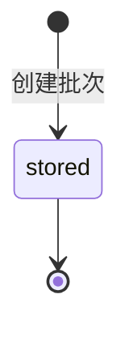
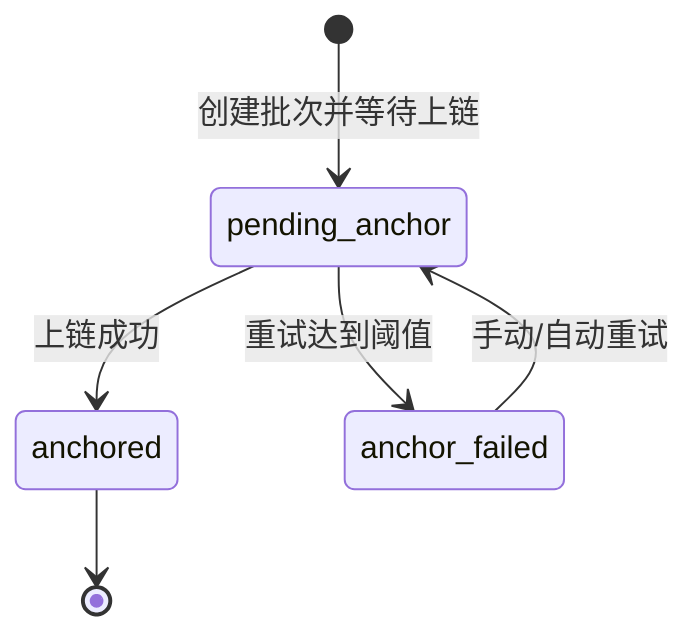

# PRD：荔枝溯源与智能采摘系统

- 文档版本：`v1.1`
- 文档日期：`2026-04-06`
- 项目仓库：`lychee-ripe`
- 文档目标：定义当前版本的软件范围、双模式溯源语义、关键接口与验收标准。

## 1. 背景与目标

系统已具备荔枝目标检测与成熟度识别能力（`green / half / red / young` 四类），当前版本在此基础上提供两种并列的溯源运行模式：

1. `database`：默认模式。批次入库后即可查询，系统不初始化链适配器，不执行补链或链上校验。
2. `blockchain`：链上模式。批次摘要写入数据库并尝试链上锚定，支持补链与公开验真。

核心目标：

1. 保持 `frontend -> gateway -> app` 主链路稳定。
2. 让 `database` 成为一等模式，而不是“关闭链能力后的降级分支”。
3. 在 `blockchain` 模式下保留现有锚定、补链与公开校验能力。

非目标：

1. 不实现硬件、IoT、机械臂等接入。
2. 不扩展为完整供应链 ERP。
3. 不在本版本中引入公网主网或真实资产交易。

## 2. 用户与场景

目标用户：

1. 果园管理员
2. 采购方 / 监管方 / 消费者
3. 开发与联调团队

核心场景：

1. 管理员在识别建批页创建批次，获得 `trace_code`。
2. 公开查询页根据 `trace_mode` 展示“数据库存证”或“区块链验真”语义。
3. 数据看板根据当前运行模式切换状态分布、补链面板和链历史展示。
4. blockchain 模式下，链节点异常时允许批次进入 `pending_anchor`，随后自动或手动补链。

## 3. 系统模式定义

### 3.1 `database` 模式

1. `trace.mode=database` 为默认配置。
2. 建批成功即为完整成功路径，状态为 `stored`，HTTP 返回 `201`。
3. 不初始化 EVM adapter。
4. 不启动自动补链 worker。
5. 不执行链上查询、锚定、补链、验签逻辑。
6. `POST /v1/batches/reconcile` 返回 `409`，错误文案需明确“当前模式不支持 reconcile”。
7. 公开查询返回 `verify_status=recorded`，表达“已入库、可查询、数据库存证”。

### 3.2 `blockchain` 模式

1. `trace.mode=blockchain` 时启用链上锚定流程。
2. 建批优先尝试上链：
   - 成功：`anchored`
   - 可恢复失败：`pending_anchor`
   - 多次失败后：`anchor_failed`
3. 允许自动补链和手动 `reconcile`。
4. 公开查询可返回 `pass / fail / pending`。

## 4. 架构与职责

系统边界保持不变：

`frontend -> gateway -> app`

职责约束：

1. `frontend` 只通过 `gateway` 访问业务接口。
2. `gateway` 负责批次持久化、模式选择、链编排与公开查询语义。
3. `app` 只负责推理与成熟度输出，不承担区块链逻辑。

## 5. 页面与交互要求

### 5.1 识别建批页 `/batch/create`

1. 展示实时识别与成熟度汇总。
2. 支持录入果园、地块、采摘时间、备注。
3. 当未熟果比例超过阈值时，提交请求必须显式携带 `confirm_unripe=true` 才允许建批。
4. 提交后返回批次信息、`trace_code`、`trace_mode`、`status`。
5. 文案要求：
   - `database + stored`：`已入库` / `数据库存证`
   - `blockchain + anchored`：`上链成功`
   - `blockchain + pending_anchor`：`已保存待补链`
   - `blockchain + anchor_failed`：`补链失败`
6. 仅在存在链上 proof 时展示链交易信息。

### 5.2 公开查询页 `/trace` 与 `/trace/{trace_code}`

1. 支持手输和二维码落地查询。
2. 始终展示批次摘要、成熟度分布、采摘时间、创建时间。
3. 根据 `trace_mode` 和运行模式展示校验结果：
   - `recorded`：数据库存证，可查询
   - `pass`：链上摘要与库内摘要一致
   - `fail`：链上摘要不一致或链上记录缺失
   - `pending`：blockchain 批次尚未上链
4. database 模式下查询到批次时不能因为“链关闭”返回 `503`。

### 5.3 数据看板页 `/dashboard`

1. 展示批次总数与成熟度分布。
2. 顶层返回并展示当前运行模式 `trace_mode`。
3. `status_distribution` 采用模式感知：
   - database：只展示 `stored`
   - blockchain：展示 `anchored / pending_anchor / anchor_failed`
4. 仅在 blockchain 模式或确有链历史数据时显示“最近链上记录”。
5. 仅在 blockchain 模式下显示补链统计。

## 6. 数据模型与状态机

### 6.1 核心字段

#### `Batch`

| 字段 | 类型 | 说明 |
| --- | --- | --- |
| batch_id | string | 批次唯一 ID |
| trace_code | string | 对外溯源码 |
| trace_mode | enum | `database \| blockchain` |
| status | enum | `stored \| pending_anchor \| anchored \| anchor_failed` |
| summary | object | 成熟度汇总，至少包含 `unripe_count`、`unripe_ratio`、`unripe_handling` |
| created_at | string(date-time) | 创建时间 |
| anchor_proof | AnchorProof/null | 仅链模式且有锚定证明时返回 |

#### `BatchCreateRequest`

| 字段 | 类型 | 说明 |
| --- | --- | --- |
| summary | object | 建批输入汇总，按识别结果填写 |
| confirm_unripe | boolean | 当 `summary` 计算出的未熟果比例超过阈值时必须为 `true` |

字段路径约束：`summary.unripe_count`、`summary.unripe_ratio`、`summary.unripe_handling` 必须作为批次聚合摘要对外返回。

#### `AnchorProof`

| 字段 | 类型 | 说明 |
| --- | --- | --- |
| tx_hash | string | 交易哈希 |
| block_number | integer | 区块高度 |
| chain_id | string | 链 ID |
| contract_address | string | 合约地址 |
| anchor_hash | string | 业务摘要哈希 |
| anchored_at | string(date-time) | 上链时间 |

#### `TraceVerifyResult`

| 字段 | 类型 | 说明 |
| --- | --- | --- |
| verify_status | enum | `recorded \| pass \| fail \| pending` |
| reason | string | 结果原因说明 |

### 6.2 状态机

#### database 模式



#### blockchain 模式



## 7. 对外接口

| 方法 | 路径 | 鉴权 | 说明 |
| --- | --- | --- | --- |
| POST | `/v1/batches` | 需要 Gateway Session Cookie 或 Bearer Token | 创建批次 |
| GET | `/v1/batches/{batch_id}` | 需要 Gateway Session Cookie 或 Bearer Token | 查询批次详情 |
| GET | `/v1/trace/{trace_code}` | 公开 | 公开溯源查询 |
| GET | `/v1/dashboard/overview` | 需要 Gateway Session Cookie 或 Bearer Token | 看板聚合接口 |
| POST | `/v1/batches/reconcile` | 需要 Gateway Session Cookie 或 Bearer Token（管理员） | blockchain 模式下手动补链 |

接口约束：

1. `trace_mode` 必须在建批、批次详情、公开查询、看板响应中显式返回。
2. `anchor_proof` 在 database 模式下不应成为必需字段。
3. `POST /v1/batches/reconcile` 在 database 模式下返回 `409`。

## 8. 关键响应示例

### 8.1 database 模式建批成功

```json
{
  "batch_id": "batch_20260406_0001",
  "trace_code": "TRC-9A7X-11QF",
  "trace_mode": "database",
  "status": "stored",
  "created_at": "2026-04-06T10:31:02+08:00",
  "anchor_proof": null
}
```

### 8.2 blockchain 模式建批成功

```json
{
  "batch_id": "batch_20260406_0002",
  "trace_code": "TRC-7K2N-3MPL",
  "trace_mode": "blockchain",
  "status": "anchored",
  "anchor_proof": {
    "tx_hash": "0xabc123...",
    "block_number": 1052,
    "chain_id": "31337",
    "contract_address": "0xdef456...",
    "anchor_hash": "0x92f0...",
    "anchored_at": "2026-04-06T10:31:01+08:00"
  }
}
```

### 8.3 database 模式公开查询

```json
{
  "batch": {
    "batch_id": "batch_20260406_0001",
    "trace_code": "TRC-9A7X-11QF",
    "trace_mode": "database",
    "status": "stored"
  },
  "verify_result": {
    "verify_status": "recorded",
    "reason": "batch is recorded in gateway database"
  }
}
```

## 9. 错误码约束

| 场景 | HTTP 状态码 | 说明 |
| --- | --- | --- |
| 缺少或错误 Gateway Session / Bearer Token | 401 / 403 | unauthorized |
| 请求参数非法 | 400 | invalid request |
| 批次不存在 | 404 | batch not found |
| 重复提交冲突 | 409 | duplicated batch |
| database 模式下调用 reconcile | 409 | trace mode conflict |
| blockchain 模式补链任务受理 | 202 | reconcile accepted |
| blockchain 模式链服务不可用 | 503 | chain unavailable |

## 10. 非功能需求

1. database 模式下，链不可用不应阻断建批与公开查询。
2. blockchain 模式下，链故障不应阻断批次落库，但应保留补链路径。
3. 网关记录关键审计日志：建批、状态变化、补链任务、公开查询异常。
4. 前端标签与颜色映射必须与 `shared/contracts` 契约一致。

## 11. 验收标准

1. database 模式建批成功后返回 `stored`，且前端只显示数据库存证语义。
2. database 模式公开查询成功返回 `recorded`，不得因链关闭返回 `503`。
3. database 模式 dashboard 正常展示批次与成熟度数据，不展示补链统计。
4. database 模式下 `POST /v1/batches/reconcile` 返回 `409`。
5. blockchain 模式下现有 anchored / pending / fail / reconcile 行为不退化。
6. 现有 `/v1/infer/image`、`/v1/infer/stream`、成熟度映射不退化。
